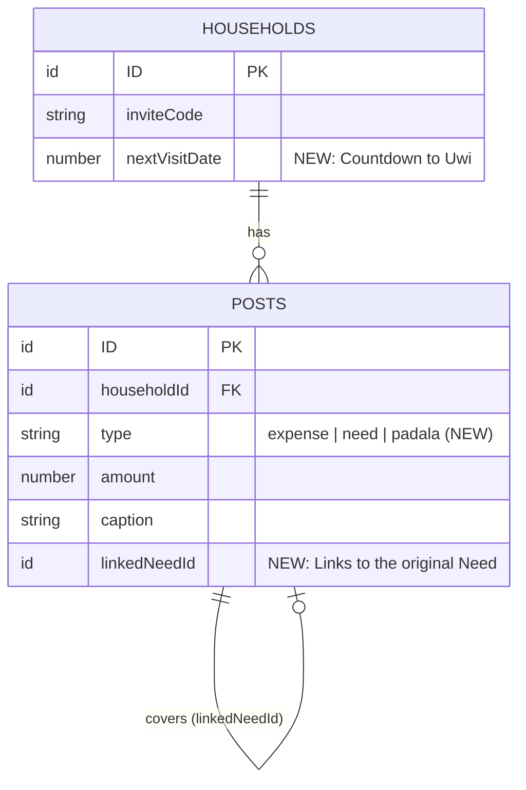

# Pillar 3: The Data Model (V2 Schema Evolution)

To support the V2 PRD (Countdown to Uwi, Padala Post Type, and Covered Celebration Loop), we need to update our Convex schema. Here are the exact structural changes.

### 1. `households` Table Changes
We will add a single field to track the upcoming homecoming date.

| Field | Type | Description |
|---|---|---|
| `nextVisitDate` | `number` (optional) | Unix timestamp of the OFW's next scheduled trip home. |

### 2. `posts` Table Changes
We need to expand the post types and add a relational link so an Expense can "cover" a Need.

| Field | Type | Description |
|---|---|---|
| `type` | `union("expense", "need", "padala")` | **[CHANGED]** Added `"padala"` to support the Remittance log. |
| `linkedNeedId` | `Id<"posts">` (optional) | **[NEW]** When logging an Expense, this points back to the original Need post it fulfills. |

### 3. New Index Strategy
To ensure the backend can instantly figure out if a Need is "Covered" without scanning the whole database, we will add a new index to the `posts` table:
*   `by_linked_need`: `["linkedNeedId"]`
*   *Why:* In the `api.posts.list` query, for every `need` post, we will instantly query `ctx.db.query("posts").withIndex("by_linked_need", q => q.eq("linkedNeedId", need._id)).first()`. If an expense exists, we return `isCovered: true` to the frontend.

---

### Mermaid ERD (Visual)

